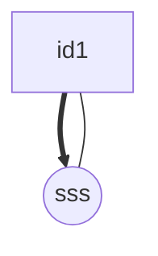
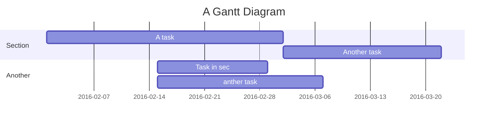

sss
sss
sss

```mermaid
graph TB
    id1==>id2((sss))
    id2---id1


```

```mermaid
gantt
    title A Gantt Diagram

    section Section
    A task           :a1, 2016-02-01, 30d
    Another task     :after a1  , 20d
    section Another
    Task in sec      :2016-02-15  , 14d
    anther task      : 2016-02-15 , 21d
```